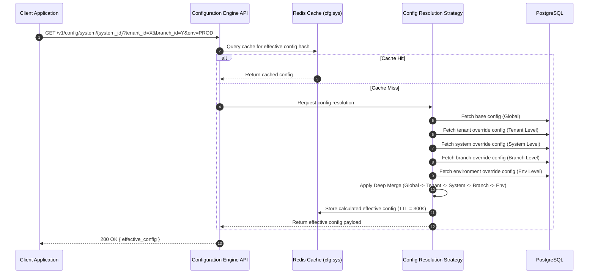

# 🧪 Use Case 9: Resolve Hierarchical System Configuration

This use case details the flow for calculating the "effective" system configuration for a client application by evaluating and merging hierarchical override layers.

---

## 🏛️ 1. Use Case Definition

| Attribute | Specification |
| :--- | :--- |
| **Name** | Resolve Hierarchical System Configuration |
| **Primary Actor** | Downstream Client System (M2M) or API Gateway |
| **Preconditions** | The system requesting configuration is registered in the UMS. |
| **Postconditions** | A JSON object representing the effective configuration (after applying all hierarchical overrides) is returned to the client and cached. |

---

## 🔄 2. Transaction Flow



### A. Main Flow
1. A client system (e.g., SCM Portal) boots up and requests its configuration from the UMS API, providing its `system_id`, `tenant_id`, and runtime context (e.g., `branch_id`, `environment`).
2. The Config API checks Redis for a pre-calculated effective configuration matching this exact context hash.
3. If a cache miss occurs, the Resolution Strategy is invoked. It queries the database for all available configuration layers applicable to the context.
4. The Engine performs a **Deep Merge** starting from the lowest priority layer (Global) and sequentially applying overrides up to the highest priority layer (Environment).
5. The final calculated object is cached with a 5-minute TTL.
6. The client system receives the final configuration JSON and adjusts its runtime behavior (e.g., hides MFA prompt if `mfa_enabled=false` at the system level despite being `true` at the tenant level).

---

## ⚙️ 3. Resolution Precedence Logic

The Deep Merge function follows this strict precedence (Priority 1 overwrites Priority 7):

1. **Environment Level**: Constraints dictated by infrastructure (e.g., `PROD` forces secure cookies).
2. **User Level**: Extreme-edge customization (e.g., `user_id_123` overrides theme).
3. **Role Level**: Config adjustments based on assigned Profile.
4. **Branch Level**: Overrides specific to a physical `branch_id` (e.g., `Callao Terminal` forces local IdP).
5. **System Level**: Application-specific overrides (e.g., `TMS` vs `WMS`).
6. **Tenant Level**: Organization-wide baseline (e.g., `LogisticsCorp`).
7. **Global Level**: UMS default hardcoded values.

### Deep Merge Example

**Tenant Level Config:**
```json
{ "auth": { "mfa_enabled": true, "session_timeout": 3600 }, "branding": { "color": "#000" } }
```

**System Level Config (Override):**
```json
{ "auth": { "mfa_enabled": false }, "modules_enabled": ["tracking"] }
```

**Resulting Effective Config:**
```json
{
  "auth": { "mfa_enabled": false, "session_timeout": 3600 },
  "branding": { "color": "#000" },
  "modules_enabled": ["tracking"]
}
```

---

## 🛡️ 4. Exception Handling

### Alternative Flow A: Missing Baseline Configuration
- If no configuration exists for the requested Tenant or System, the resolver gracefully falls back to the Global Default Level. It does not return a 404, guaranteeing the client system receives safe fallback values to operate.

### Alternative Flow B: Config Syntax Error during Merge
- If a custom JSON override contains invalid syntax that breaks the deep merge process, the engine logs an error to the Audit Context and skips that specific layer, proceeding with the lower-priority layers.
