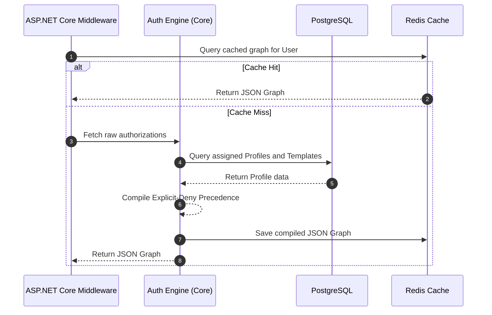

# 🛡️ Technical Enabler 1: Build User Authorization Graph

This document specifies the transaction flow, actors, and caching strategies for compiling the dynamic graph of allowed actions and resources for an authenticated session under the **spec-driven AI strategy BMAD-METHOD**.

---

## 🏛️ 1. Use Case Definition

| Attribute | Specification |
| :--- | :--- |
| **Name** | Build User Authorization Graph |
| **Primary Actor** | Authentication Guard / API Gateway |
| **Preconditions** | User is successfully authenticated. |
| **Postconditions** | A lightweight hierarchical JSON permission graph is compiled and cached in Redis. |

---

## 🔄 2. Transaction Flow

### A. Main Flow
1.  The .NET 8 request interceptor/guard receives an incoming API request.
2.  The guard queries the high-performance Redis cache cluster using the unique `user_id` as the key.
3.  **Cache Hit Case**: Redis returns the pre-compiled hierarchical JSON permission graph. The guard instantly resolves the permission (Target p95 < 5ms).
4.  **Cache Miss Case**: The guard dispatches a compile command to the core Authorization Engine.
5.  The engine queries PostgreSQL to retrieve all `Profiles` assigned to the `User` and any parent `Authorization Templates` linked to those profiles.
6.  The engine applies the **Explicit-Deny Precedence rules**:
    *   Find all `ALLOW` policies.
    *   Find all `DENY` policies.
    *   Any `DENY` instantly overrides matching `ALLOW` rules.
7.  The engine compiles a lightweight tree mapping allowed `Systems ➔ Menus ➔ Options ➔ Actions`.
8.  The engine saves the JSON tree inside Redis with a Time-To-Live (TTL) of 1 hour and returns the resolved graph to the guard.

---

## 🛡️ 3. Alternative Flows & Exception Handling

### Alternative Flow A: Cache Server Offline
*   If Redis is down or times out, the guard intercepts the cache error and gracefully queries the PostgreSQL database directly, ensuring total system availability with slightly degraded read latency.

### Alternative Flow B: Empty Profile Assignment
*   If a user has no active Profiles assigned to their account, the engine returns an empty JSON graph with an unassigned status, preventing the user from viewing any sub-portals.

---

## 📋 4. Primary Operational Model Reference
The complete transaction flow, Redis caching strategy, and Explicit-Deny compilation rules for this use case are modeled around the **SCM Transportation Analyst** role at the Callao Terminal (under *Logistics Corp*). For the detailed technical schemas, parameter structures, and OpenAPI examples, consult **[enterprise-iam-ums-specification.md](../../04-artifacts/enterprise-iam-ums-specification.md)**.

