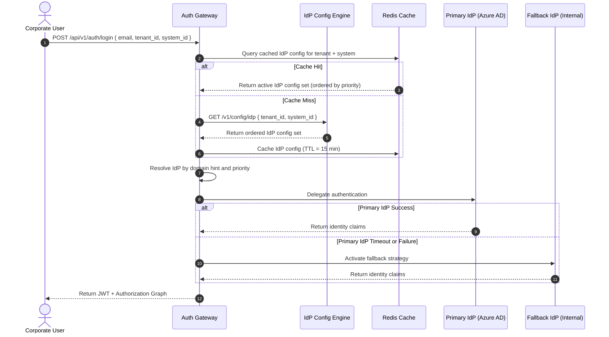
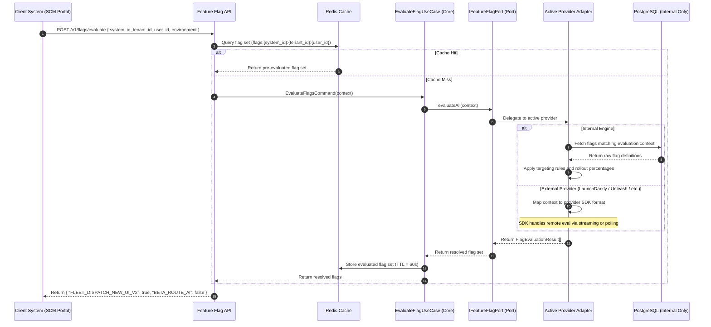

# 📐 UMS Configuration Platform — Functional & Architectural Specification

**Version:** 2.0.0 | **Status:** Accepted | **Method:** bMAD  
**Classification:** Core Platform Capability — Cross-Cutting Concern

> [!IMPORTANT]
> This specification introduces a **new cross-cutting bounded context** — the **Configuration & Feature Management Context** — that impacts the domain model, bounded context map, C4 diagrams, and existing ADRs. All teams must align to this document before implementing any configuration or feature flag capability.

---

## 🧭 1. Business Context & Strategic Rationale

Modern enterprise SaaS platforms require the ability to **adapt behavior at runtime without redeployment**. The UMS Configuration Platform provides a centralized, multi-tenant, auditable, and API-first parametrization engine that governs three orthogonal concerns:

1. **Identity Provider (IdP) Configuration** — *Who authenticates the user and how*
2. **System Behavioral Configuration** — *How each integrated application behaves at runtime*
3. **Feature Flag Management** — *Which features are active, for whom, and under what conditions — via a pluggable provider model*

These capabilities eliminate the need for environment-specific deployments when toggling behavior, adapting authentication strategies, or rolling out features progressively — enabling **Zero-Deployment Governance**.

---

## 📋 2. Pillar 1 — Multi-IdP Configuration Engine

### 2.1 Functional Requirements

The UMS must allow per-tenant (and optionally per-system) configuration of one or more Identity Providers (IdPs):

| Capability | Requirement |
| :--- | :--- |
| **Multiple IdPs per Tenant** | A tenant may register and activate more than one IdP simultaneously (e.g., Azure AD for employees + Google for contractors). |
| **IdP Type Registry** | Supported types: `INTERNAL_BCRYPT`, `ZITADEL`, `AZURE_AD`, `OKTA`, `KEYCLOAK`, `AUTH0`, `GOOGLE`, `LDAP`, `SAML2`, `GENERIC_OIDC`. |
| **Priority & Fallback Rules** | Each IdP entry has a `priority` rank. If the primary IdP is unreachable (timeout/500), the engine falls back in priority order. |
| **Hybrid Authentication** | A tenant may have INTERNAL + EXTERNAL IdPs active simultaneously. The routing strategy is evaluated per login attempt based on user domain hints. |
| **Per-System Association** | An IdP configuration can be scoped to a specific `system_id` (e.g., only the HCM Portal uses LDAP; SCM uses Azure AD). |
| **Secure Credential Storage** | OAuth client secrets, SAML certificates, and LDAP bind credentials are encrypted at rest using AES-256 and referenced by `config_secret_ref`. |

### 2.2 IdP Configuration Schema

```json
{
  "idp_config_id": "idp_azure_logisticscorp",
  "tenant_id": "tenant_logistics_corp",
  "system_id": "scm_route_planner",
  "provider_type": "AZURE_AD",
  "priority": 1,
  "fallback_to": "idp_internal_logisticscorp",
  "status": "ACTIVE",
  "config": {
    "authority_url": "https://login.microsoftonline.com/{tenant-id}/v2.0",
    "client_id": "app-client-id-xyz",
    "config_secret_ref": "vault://ums/secrets/logisticscorp/azure_client_secret",
    "scopes": ["openid", "profile", "email"],
    "user_claim_mapping": {
      "identity_reference": "identityId",
      "email": "upn"
    }
  },
  "domain_hints": ["@logisticscorp.com"],
  "mfa_enforced": true,
  "created_at": "2026-05-09T00:00:00Z",
  "version": "1.0.0"
}
```

### 2.3 Sequence: IdP Resolution at Login



---

## 📋 3. Pillar 2 — System Behavioral Configuration Model

### 3.1 Functional Requirements

Each system registered in UMS must support a **dynamic, versioned, auditable configuration schema** that controls its runtime behavior:

| Parameter Category | Configurable Parameters |
| :--- | :--- |
| **Authentication** | `auth_strategy`, `mfa_enabled`, `mfa_method` (`TOTP`, `WEBAUTHN`, `SMS`), `passwordless_enabled` |
| **Session Policy** | `access_token_ttl_seconds`, `refresh_token_ttl_seconds`, `idle_session_timeout_seconds`, `max_concurrent_sessions` |
| **Multi-Tenancy Restrictions** | `allowed_organizations`, `blocked_regions`, `ip_allowlist`, `branch_restriction_enabled` |
| **Onboarding** | `self_registration_enabled`, `email_verification_required`, `auto_profile_creation_enabled` |
| **Branding & UI** | `primary_color`, `logo_url`, `login_background_url`, `tenant_display_name`, `hosted_login_enabled`, `custom_css_url`, `font_family` |
| **Module Enablement** | `modules_enabled: ["fleet_dispatch", "route_planning", "audit_export"]` |

### 3.2 Configuration Schema

```json
{
  "system_config_id": "cfg_scm_logisticscorp_v2",
  "system_id": "scm_route_planner",
  "tenant_id": "tenant_logistics_corp",
  "version": "2.1.0",
  "status": "ACTIVE",
  "auth": {
    "mfa_enabled": true,
    "mfa_method": "WEBAUTHN",
    "passwordless_enabled": false,
    "session_timeout_seconds": 3600
  },
  "onboarding": {
    "self_registration_enabled": false,
    "auto_profile_creation_enabled": true,
    "default_profile_template": "Template_SCM_Analyst_Baseline_v1"
  },
  "branding": {
    "primary_color": "#0B3D91",
    "logo_url": "https://cdn.logisticscorp.com/logo.svg",
    "hosted_login_enabled": true,
    "custom_css_url": "https://cdn.logisticscorp.com/styles/login-override.css",
    "font_family": "Outfit, sans-serif"
  },
  "modules_enabled": ["fleet_dispatch", "route_planning"],
  "published_at": "2026-05-09T00:00:00Z",
  "published_by": "usr_admin_superadmin_001"
}
```

### 3.3 Key Design Properties
- **Multi-tenant**: scoped by `tenant_id` + `system_id` composite key
- **Versioned**: each configuration change produces a new version; previous versions are archived (not deleted)
- **Auditable**: every write triggers a `SystemConfigUpdatedEvent` written to the Audit Context
- **API-first**: all configurations are read via `GET /v1/config/system/{system_id}?tenant_id=X`
- **Cache-backed**: configurations are cached in Redis at `cfg:sys:{system_id}:{tenant_id}` with a 5-minute TTL and evicted on `SystemConfigUpdatedEvent`

### 3.4 Hierarchical Resolution Strategy (Inheritance & Overrides)

To support massive enterprise multi-tenancy without duplicating configuration data, the UMS employs a **Dynamic Configuration Resolution Engine** based on an inheritance and override model.

When a client system requests its configuration, the UMS engine calculates the "effective configuration" by merging layers in the following precedence order (highest priority last):

1. **Global Default Level**: Hardcoded application defaults.
2. **Tenant Level**: Overrides applied to the entire Organization (`tenant_id`).
3. **System Level**: Overrides specific to an application within a tenant (`system_id`).
4. **Organization/Branch Level**: Localized overrides for a specific branch (`branch_id`).
5. **Role Level**: Behavior overrides applied via profile/role templates.
6. **User Level**: Extreme-edge customization specific to a `user_id` (e.g., accessibility settings).
7. **Environment Level**: Final override based on runtime environment (`STAGING`, `PROD`).

**Resolution Logic:**
- Each parameter is resolved individually using a Deep Merge strategy.
- If a parameter is explicitly set at a higher priority level, it overrides the lower levels.
- This guarantees that a Tenant can set a baseline `mfa_enabled=true`, but a specific System (e.g., public tracking portal) can override it to `mfa_enabled=false` without duplicating the entire config object.

---

## 📋 4. Pillar 3 — Feature Flag Management Framework (Pluggable Provider Architecture)

> [!IMPORTANT]
> The Feature Flag framework is designed under the **same hexagonal abstraction principle** as the IdP strategy. The UMS core MUST NOT depend on any specific feature flag vendor or implementation. All evaluation is routed through a **pluggable `IFeatureFlagPort` adapter**. This enables zero-impact migration between internal and external flag engines.

### 4.1 Functional Requirements

| Capability | Requirement |
| :--- | :--- |
| **Pluggable Provider** | Flag evaluation is abstracted behind `IFeatureFlagPort`. Providers: Internal Engine, LaunchDarkly, Unleash, ConfigCat, Azure App Configuration, or any custom adapter. |
| **Scoped Targeting** | Flags can be scoped to: `tenant`, `organization`, `branch`, `role`, `user`, `environment`, `system` |
| **Flag Types** | `BOOLEAN` (on/off), `VARIANT` (A/B/multivariate), `PERCENTAGE` (gradual rollout 0–100%) |
| **Evaluation Targets** | Menus, Modules, API Endpoints, Internal Workflows, UI Components, Technical Toggles (non-visible) |
| **Real-Time Evaluation** | Flags evaluated in real-time via API without requiring application redeployment |
| **Unique Flag Codes** | Each flag has a globally unique `flag_code` string consumed by client systems |
| **Gradual Rollout** | Percentage-based rollout supports Canary releases and Beta feature strategies |
| **Audit Trail** | Every flag state change logged immutably with actor, timestamp, and previous state |
| **Distributed Cache** | Evaluated flag sets cached per evaluation context — TTL governed per provider |

---

### 4.2 Pluggable Provider Architecture — `IFeatureFlagPort`

The Feature Flag engine follows the same **Hexagonal Architecture (Ports & Adapters)** pattern applied to the IdP subsystem. The UMS Core Use Cases interact **exclusively** with the `IFeatureFlagPort` interface. The concrete provider is injected via dependency injection at startup, configured per system or tenant.

```
┌─────────────────────────────────────────────────────────────────────┐
│                     UMS Core (Domain Layer)                         │
│                                                                     │
│   EvaluateFlagUseCase ──────────────► IFeatureFlagPort (Port)       │
│                                            │                        │
└────────────────────────────────────────────┼────────────────────────┘
                                             │
                    ┌────────────────────────┼────────────────────────┐
                    │     Infrastructure Adapters (Implementations)   │
                    ├────────────────────────┼────────────────────────┤
                    ▼                        ▼                        ▼
        ┌───────────────────┐   ┌────────────────────┐  ┌─────────────────────┐
        │ InternalFlagEngine│   │LaunchDarklyAdapter │  │  UnleashAdapter     │
        │ (UMS built-in)    │   │(LaunchDarkly SDK)  │  │  (Unleash SDK)      │
        └───────────────────┘   └────────────────────┘  └─────────────────────┘
                    ▼                        ▼                        ▼
        ┌───────────────────┐   ┌────────────────────┐  ┌─────────────────────┐
        │ ConfigCatAdapter  │   │AzureAppConfigAdapter│  │ CustomProviderAdapter│
        │ (ConfigCat SDK)   │   │(Azure SDK)          │  │ (Future extension)  │
        └───────────────────┘   └────────────────────┘  └─────────────────────┘
```

#### `IFeatureFlagPort` Interface Contract

```typescript
interface IFeatureFlagPort {
  /**
   * Evaluate a single flag for a given evaluation context.
   * Returns boolean, string (variant), or number (percentage bucket).
   */
  evaluate(
    flagCode: string,
    context: FlagEvaluationContext
  ): Promise<FlagEvaluationResult>;

  /**
   * Bulk-evaluate all active flags for a given context.
   * Used at session initialization to minimize round-trips.
   */
  evaluateAll(
    context: FlagEvaluationContext
  ): Promise<Record<string, FlagEvaluationResult>>;

  /**
   * Check if the provider is healthy and reachable.
   * Used by circuit breaker and health check endpoints.
   */
  isHealthy(): Promise<boolean>;
}

interface FlagEvaluationContext {
  flagCode?: string;
  systemId: string;
  tenantId: string;
  organizationId?: string;
  branchId?: string;
  userId?: string;
  userRoles?: string[];
  environment: 'development' | 'staging' | 'production';
}

interface FlagEvaluationResult {
  flagCode: string;
  value: boolean | string | number;
  reason: 'TARGETING_MATCH' | 'DEFAULT' | 'FALLBACK' | 'DISABLED' | 'CACHE_HIT';
  providerName: string;
}
```

---

### 4.3 Provider Registry & Selection Strategy

The active Feature Flag provider is resolved per request using a **provider selector strategy**:

1. **Global Default Provider**: Configured in `system_configuration.feature_flag_provider` (e.g., `INTERNAL`).
2. **Per-Tenant Override**: A tenant may override the default provider (e.g., *LogisticsCorp* uses LaunchDarkly; all others use Internal).
3. **Fallback Chain**: If the primary provider fails health check, the system falls back to the `InternalFlagEngine` adapter automatically.

```json
{
  "feature_flag_provider_config": {
    "default_provider": "INTERNAL",
    "tenant_overrides": {
      "tenant_logistics_corp": {
        "provider": "LAUNCH_DARKLY",
        "sdk_key_ref": "vault://ums/secrets/logisticscorp/ld_sdk_key",
        "fallback_provider": "INTERNAL"
      }
    }
  }
}
```

---

### 4.4 Supported Providers

| Provider | Adapter Class | Notes |
| :--- | :--- | :--- |
| **Internal Engine** | `InternalFlagEngineAdapter` | Built-in UMS engine. Flags stored in PostgreSQL + Redis. Default for all tenants unless overridden. |
| **LaunchDarkly** | `LaunchDarklyFlagAdapter` | Uses LaunchDarkly Server SDK. Evaluation contexts mapped to LD user objects. |
| **Unleash** | `UnleashFlagAdapter` | Uses Unleash SDK with toggle name mapped to `flag_code`. Context mapped to Unleash context. |
| **ConfigCat** | `ConfigCatFlagAdapter` | Uses ConfigCat Server SDK. `flag_code` mapped to ConfigCat setting key. |
| **Azure App Configuration** | `AzureAppConfigFlagAdapter` | Uses Azure SDK feature manager with filter conditions mapped to targeting rules. |
| **Custom** | `CustomFlagAdapter` | Implements `IFeatureFlagPort`. Any future provider registered as a NestJS injectable. |

---

### 4.5 Flag Definition Schema (Internal Engine)

```json
{
  "flag_id": "flag_fleet_dispatch_new_ui",
  "flag_code": "FLEET_DISPATCH_NEW_UI_V2",
  "type": "PERCENTAGE",
  "description": "Enables the redesigned Fleet Dispatch UI — progressive rollout.",
  "targets": {
    "systems": ["scm_route_planner"],
    "tenants": ["tenant_logistics_corp"],
    "environments": ["staging", "production"],
    "rollout_percentage": 25
  },
  "status": "ACTIVE",
  "linked_to": {
    "type": "menu",
    "resource_id": "menu_fleet_dispatch"
  },
  "feature_flag_provider": "INTERNAL",
  "created_by": "usr_admin_superadmin_001",
  "created_at": "2026-05-09T00:00:00Z",
  "version": "1.0.0"
}
```

---

### 4.6 Feature Flag Evaluation Flow (Pluggable)



---

### 4.7 Rollout Strategy Support

| Strategy | Flag Type | Implementation |
| :--- | :--- | :--- |
| **Canary Release** | `PERCENTAGE` | Start at 5% of tenant users, increment gradually via Console UI |
| **Beta Features** | `BOOLEAN` | Scoped to a specific `user_id` list (beta testers) |
| **Environment Gating** | `BOOLEAN` | Active only in `staging`; disabled in `production` until graduated |
| **Tenant A/B Test** | `VARIANT` | Two variants assigned to two tenant groups; metrics collected externally |
| **Technical Toggle** | `BOOLEAN` | Non-UI flag toggling backend behavior (e.g., new caching algorithm) |

---

## 📊 5. Impact Analysis

### 5.1 Domain Model — New Entities Required

| New Entity | Context | Purpose |
| :--- | :--- | :--- |
| `IDP_CONFIGURATION` | Config Context | Per-tenant/system IdP registry with priority/fallback |
| `SYSTEM_CONFIGURATION` | Config Context | Versioned behavioral config per system/tenant |
| `FEATURE_FLAG` | Config Context | Flag definition with targeting rules and provider metadata |
| `FLAG_EVALUATION_LOG` | Audit Context | Immutable log of flag evaluations |
| `FEATURE_FLAG_PROVIDER_CONFIG` | Config Context | Per-tenant provider overrides and SDK key references |

### 5.2 Bounded Context Impact

> [!IMPORTANT]
> A **new bounded context** — `Configuration & Feature Management Context` — is introduced. This context cannot be merged with existing contexts without violating the Single Responsibility Principle.

**New context owns:**
- `IdpConfiguration` aggregate
- `SystemConfiguration` aggregate (versioned)
- `FeatureFlag` aggregate
- `FeatureFlagProviderConfig` aggregate
- `IFeatureFlagPort` (core port — pluggable)
- `IConfigCachePort` (core port — separate from auth cache)
- `ISecretStorePort` (core port — for vault-referenced credentials)

### 5.3 C4 Diagram Impact

**Level 1 (System Context):**
- Add: `Configuration & Feature Management API` as a new UMS external capability

**Level 2 (Container):**
- Add: `Config & Feature Flag Module (NestJS)` container with `IFeatureFlagPort`
- Add: `Redis: cfg + flags namespace` (distinct from `auth_graph` namespace)
- Add: Dashed external provider connections to LaunchDarkly / Unleash / ConfigCat

### 5.4 ADR Impact

| ADR | Impact | Action |
| :--- | :--- | :--- |
| ADR-0010 (Multi-Tenancy) | Config entities respect RLS automatically | No change |
| ADR-0014 (Redis Caching) | New namespaces `cfg:*`, `flags:*` | Extend with namespace governance table |
| ADR-0016 (Immutable Audit) | Config + flag mutations trigger audit subscribers | No change — pattern applies |
| ADR-0017 (Feature Flagging) | **Superseded by ADR-0025** for pluggable provider design | Mark ADR-0017 as superseded |
| ADR-0020 (IdP Abstraction) | Extended with multi-IdP priority/fallback model | Extend ADR-0020 |
| **ADR-0025** (new) | Feature Flag Provider Abstraction via `IFeatureFlagPort` | **Created** — see [ADR-0025](../../docs/03-adrs/0025-feature-flag-provider-abstraction.md) |

### 5.5 API Contracts — New Endpoints

| Endpoint | Method | Description |
| :--- | :--- | :--- |
| `/v1/config/idp` | `GET` | Returns ordered IdP config for a `tenant_id` + `system_id` |
| `/v1/config/idp` | `POST` | Register a new IdP configuration |
| `/v1/config/idp/{id}` | `PUT` | Update an IdP configuration |
| `/v1/config/system/{system_id}` | `GET` | Returns active system config for a tenant |
| `/v1/config/system` | `POST` | Publish a new system configuration version |
| `/v1/flags` | `GET` | List all active feature flags (admin context) |
| `/v1/flags` | `POST` | Create a new feature flag |
| `/v1/flags/{flag_code}` | `PATCH` | Update flag status or targeting rules |
| `/v1/flags/evaluate` | `POST` | Evaluate active flags for a given runtime context (proxies to active provider) |
| `/v1/flags/provider/health` | `GET` | Health check of the active feature flag provider |

### 5.6 Integration Events — New Domain Events

| Event | Published By | Consumed By | Purpose |
| :--- | :--- | :--- | :--- |
| `IdpConfigCreatedEvent` | Config Context | Audit | Track IdP registrations |
| `IdpConfigUpdatedEvent` | Config Context | Audit + Cache Eviction | Invalidate cached IdP config |
| `SystemConfigPublishedEvent` | Config Context | Audit + Cache Eviction + Client Systems | Broadcast config changes |
| `FeatureFlagCreatedEvent` | Config Context | Audit | Track flag lifecycle |
| `FeatureFlagStateChangedEvent` | Config Context | Audit + Cache Eviction + Client Systems | Broadcast flag state changes |
| `FeatureFlagProviderChangedEvent` | Config Context | Audit + All Consumers | Alert when active provider switches |

### 5.7 Extensibility via Provider/Adapter Strategy

The `IFeatureFlagPort` is the **only integration point** between UMS core and any feature flag vendor. Adding a new provider requires:
1. Implement `IFeatureFlagPort` in a new adapter class.
2. Register the adapter as a NestJS injectable with a provider type discriminator.
3. Update the `FEATURE_FLAG_PROVIDER_CONFIG` schema with the new provider type.
4. No changes to domain entities, use cases, or API controllers.

This ensures **zero core-layer changes** when switching or extending providers.

---

## 🚧 6. Non-Functional Requirements

| Attribute | Requirement |
| :--- | :--- |
| **Performance (Flag Eval — Cache Hit)** | p95 < 3ms |
| **Performance (Flag Eval — Cache Miss / External)** | p95 < 50ms |
| **Cache TTL** | IdP config: 15 min \| System config: 5 min \| Flag sets: 60s |
| **Security** | IdP & provider credentials encrypted AES-256; never returned in plaintext |
| **Versioning** | Config entities support semantic versioning; mutations archive prior versions |
| **Audit** | 100% of config mutations and flag state changes written to immutable ledger |
| **Availability** | Config API tolerates DB unavailability via last-known-good Redis fallback |
| **Isolation** | All entities RLS-enforced by `tenant_id` |
| **Observability** | Every flag evaluation carries `traceId` and `providerName` in structured logs |
