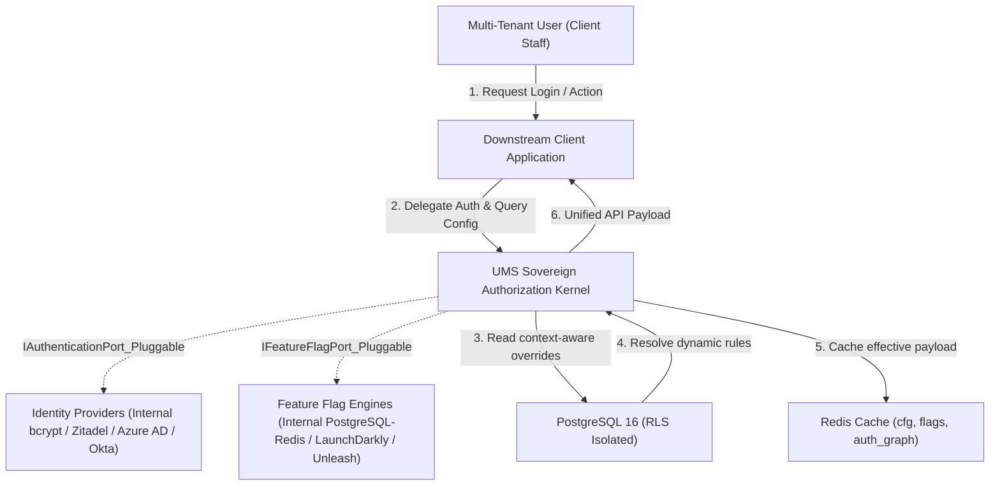

> ?? **Nota de Arquitectura:** Este documento se encuentra actualmente en su versión original (Inglés) y está programado para traducción oficial en la hoja de ruta.

# 💼 Business Context - User Management System (UMS)

## 1. Problem Statement
Historically, corporate software ecosystems suffer from fragmented identity and access governance. Each system (TMS, WMS, CRM) manages its own local database of users, password hashes, and authorization roles. This results in:
- **Severe Security Vulnerabilities**: Fragmented password databases increase the attack surface and make password policy enforcement impossible.
- **High Administrative Overhead**: Employees must be manually onboarded and offboarded across multiple applications, leading to "orphan accounts" with active access.
- **Lack of Central Auditability**: Tracking "who did what" and "who has access to what" across multiple isolated databases is practically impossible, violating regulatory compliance.
- **Inefficient Multi-Tenancy**: B2B clients cannot self-manage their organizations, causing continuous support ticket overhead for the primary software vendor.

---

## 2. Proposed Solution
UMS resolves these issues by serving as an **abstract, sovereign Authorization & Identity Gateway** for any downstream client system or integrated enterprise suite.

UMS separates **Authentication**, **Authorization**, and **Dynamic Configuration**:
1.  **Authentication (Identity)**: Treated as an abstract, pluggable service layer. UMS validates "who" the user is using secure, federated Single Sign-On (SSO), SAML, OIDC, WebAuthn (Passkeys), or an internal credentials database, dynamically routing to external Identity Providers (such as Zitadel, AWS Cognito, Microsoft Entra ID, Okta, or Keycloak) on a per-tenant basis without impacting business logic.
2.  **Authorization (Permissions)**: Controlled centrally by UMS. UMS stores the definitions of client systems, menus, permission graphs, roles, and profiles, injecting authorization tokens and dynamic menus into downstream applications on demand.
3.  **Dynamic Configuration & Feature Flags**: UMS governs the runtime behavior of downstream systems via a hierarchical multi-tenant configuration model and an extensible feature flag framework (LaunchDarkly, Unleash, Internal), enabling zero-deployment behavioral shifts and progressive rollouts.

---

## 3. Executive Business Rationale
Standardizing access under UMS provides three massive business benefits:
- **Zero Ticket Onboarding**: Clients self-manage their administrative scopes through delegable profiles and tenant-specific settings.
- **Zero-Deployment Agility**: Real-time feature flags and dynamic hierarchical configuration overrides (Tenant > System > Org > Environment) allow immediate business adjustments without code releases.
- **Compliance Ready**: Immutable business audit logs (CDC/Subscribers) track all critical permission mutations and configuration state changes, making the system instantly ready for SOC 2 and ISO 27001 certifications.
- **Enterprise-Grade Security**: Passwordless cryptography completely eliminates brute-force vectors and credentials theft.

---

## 4. Reference Operational Model
To illustrate the real-world operational execution of UMS, our specifications utilize the **SCM Transportation Analyst** scenario as the primary reference model. This role represents high-concurrency B2B access to the *SCM Route Planner* under the context of specific tenants (e.g., *Logistics Corp*) and localized branches (e.g., *Callao Terminal, Peru*). 

The detailed architectural specs, sequence diagrams, and dynamic API contracts for this reference model are fully detailed in **[enterprise-iam-ums-specification.md](../04-artifacts/enterprise-iam-ums-specification.md)**.

