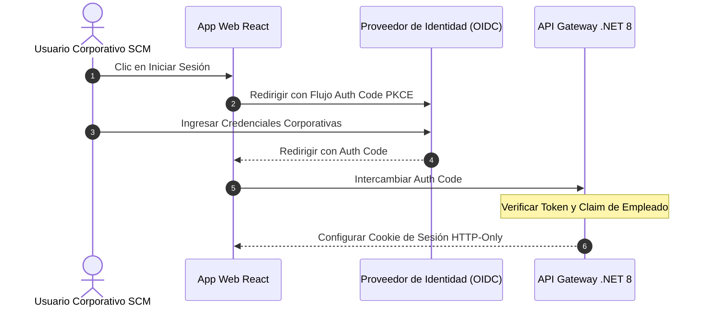

# 📘 Functional Story 1: Autenticación de Usuario vía IdP Externo

Este documento especifica el flujo de transacciones, los actores y las estrategias de respaldo para autenticar a un usuario corporativo mediante un proveedor de identidad externo (IdP) bajo la **estrategia spec-driven AI BMAD-METHOD**.

---

## 🏛️ 1. Definición del Caso de Uso

| Atributo | Especificación |
| :--- | :--- |
| **Nombre** | Autenticación de Usuario vía IdP Externo |
| **Actor Principal** | Usuario Corporativo SCM |
| **Precondiciones** | El usuario está registrado en la base de datos de ULPMS y posee una referencia válida de empleado de RRHH. |
| **Postcondiciones** | La sesión se establece en la aplicación SCM y se devuelve una cookie segura HTTP-Only. |

---

## 🔄 2. Flujo de Transacción

### A. Flujo Principal
1.  El usuario accede al portal SCM y hace clic en el botón "Iniciar Sesión con SSO Corporativo".
2.  El cliente web redirige al usuario al endpoint de autorización del Proveedor de Identidad externo configurado (Keycloak/Azure AD) utilizando el **Flujo de Código de Autorización OAuth 2.0 con PKCE**.
3.  El usuario se autentica exitosamente utilizando sus credenciales corporativas en el portal del IdP.
4.  El IdP redirige el navegador de vuelta al portal SCM con un Código de Autorización de un solo uso autorizado.
5.  El backend SCM intercambia el Código de Autorización con el IdP por un Token de Acceso firmado criptográficamente (JWT) que contiene los claims del empleado.
6.  El backend verifica la firma RS256 del token y valida que la `employee_reference` coincida con un registro de empleado activo en la base de datos local de SCM.
7.  El sistema inicializa la sesión del usuario, inyecta el contexto del tenant y devuelve una cookie de sesión segura, HTTP-Only y SameSite=Strict.

---

## 🛡️ 3. Flujos Alternativos y Manejo de Excepciones

### Flujo Alternativo A: IdP Externo Inaccesible
*   Si falla la conexión a Keycloak/Azure AD, el Gateway SCM intercepta el error de tiempo de espera (timeout).
*   El sistema muestra una página de credenciales de respaldo segura que permite a los Administradores de TI autorizados iniciar sesión utilizando credenciales locales de emergencia de ULPMS, mientras que a los operadores estándar se les solicita reintentar.

### Flujo Alternativo B: Referencia de Empleado no Vinculada
*   Si el token del IdP autenticado es exitoso pero no se encuentra la `employee_reference` o está suspendida en la base de datos SCM:
    *   El backend aborta el proceso de inicio de sesión.
    *   Guarda una advertencia de seguridad dentro de los registros de auditoría de acceso inmutables.
    *   Devuelve una respuesta `403 Forbidden` explicando que la cuenta corporativa no está activa en el portal SCM.

---

## 📋 4. Referencia del Modelo Operativo Principal
El flujo de transacción completo, las consideraciones de autenticación multifactor y las rutas de error para este caso de uso están modeladas en torno al **Analista de Transporte SCM** iniciando una sesión en el Terminal Portuario del Callao (bajo *Logistics Corp*). Para conocer los esquemas técnicos detallados, estructuras de parámetros y ejemplos de OpenAPI, consulte **[enterprise-iam-ums-specification.md](../../04-artifacts/enterprise-iam-ums-specification.md)**.
