# 🧪 Functional Story 4: Registrar Sistema y Definir Topología de Menú

Este caso de uso especifica el flujo para registrar una nueva aplicación cliente (Sistema) en el UMS y definir su jerarquía de recursos de navegación (Menús, Submenús, Opciones y Acciones).

---

## 🏛️ 1. Definición del Caso de Uso

| Atributo | Especificación |
| :--- | :--- |
| **Nombre** | Registrar Sistema y Definir Topología de Menú |
| **Actor Principal** | Administrador de Seguridad Global (SuperAdmin) |
| **Precondiciones** | El actor está autenticado como SuperAdmin en la Consola de Administración UMS. |
| **Postcondiciones** | El Sistema se registra con una credencial de API M2M segura. La topología de menú se define y está disponible para la asignación de plantillas. |

---

## 🔄 2. Flujo de Transacción

```mermaid
sequenceDiagram
    autonumber
    actor Admin as Administrador de Seguridad
    participant Console as Consola Admin UMS
    participant API as API .NET 8 UMS
    participant DB as PostgreSQL
    participant Audit as Registro de Auditoría

    Admin->>Console: Navegar a Sistemas > Registrar Nuevo Sistema
    Admin->>Console: Llenar nombre del sistema, código, URL base
    Console->>API: POST /api/v1/systems { name, system_code, base_url }
    API->>DB: Insertar registro SYSTEM, generar api_credential_hash
    API->>Audit: Registrar Evento SystemRegisteredEvent
    API-->>Console: 201 Created { systemId, apiCredential }
    Console-->>Admin: Mostrar credencial del sistema (una sola vez, pedir copiar)
    Admin->>Console: Navegar a Sistemas > Topología > Agregar Menú
    loop Construir Árbol de Menús
        Admin->>Console: Agregar Menú → Submenús → Opciones → Acciones
        Console->>API: POST /api/v1/systems/{id}/menus (batch recursivo)
        API->>DB: Insertar registros MENU / SUBMENU / OPTION / ACTION
    end
    API-->>Console: Confirmación de topología guardada
```

### A. Flujo Principal
1. El SuperAdmin navega a **Sistemas** y hace clic en **Registrar Nuevo Sistema**.
2. Llena el nombre del sistema (`SCM Route Planner`), código de máquina (`scm_route_planner`) y la URL base.
3. La API genera una credencial de API M2M única y hasheada que las aplicaciones cliente utilizarán en los encabezados `Authorization: Bearer` al llamar a `POST /v1/authorization/graph`. Esta credencial se muestra **una sola vez** y debe ser guardada.
4. El administrador navega al **Constructor de Topología** para el sistema registrado y construye el árbol de navegación: `Menús → Submenús → Opciones → Acciones`.
5. Cada nodo especifica una etiqueta, un índice de orden y (para las Acciones) un mapeo de endpoint de la API y código de acción (`create`, `read`, `update`, `delete`, `export`, `approve`).

---

## 🛡️ 3. Flujos Alternativos y Manejo de Excepciones

### Flujo Alternativo A: Código de Sistema Duplicado
- Si el `system_code` ya existe, la API devuelve un `409 Conflict` con el código de error `ERR_DUPLICATE_SYSTEM_CODE`.

### Flujo Alternativo B: Topología Incompleta
- Si una Opción no tiene Acciones definidas, la topología se guarda como borrador pero no puede ser referenciada en Plantillas de Autorización hasta que se vincule al menos una Acción.
