# 🧪 Functional Story 5: Crear Perfil y Asignar Manualmente Plantilla de Autorización

Este caso de uso especifica el flujo para crear un Perfil de usuario dentro de un contexto de Organización/Sede y **asignar manualmente** una o más Plantillas de Autorización a este a través de la Consola de Administración.

---

## 🏛️ 1. Definición del Caso de Uso

| Atributo | Especificación |
| :--- | :--- |
| **Nombre** | Crear Perfil y Asignar Manualmente Plantilla de Autorización |
| **Actor Principal** | Administrador de Seguridad Global (SuperAdmin) o Gestor de Operaciones de Tenant (LocalAdmin) |
| **Precondiciones** | La Organización destino, Sede y al menos una Plantilla de Autorización están registradas en el sistema. |
| **Postcondiciones** | El Perfil es creado y se encuentra activo. La Plantilla es vinculada. Todos los usuarios asignados a este perfil heredan el grafo de permisos compilado inmediatamente. Las claves de caché de Redis para los usuarios afectados son desalojadas. |

---

## 🔄 2. Flujo de Transacción

```mermaid
sequenceDiagram
    autonumber
    actor Admin as Administrador de Seguridad
    participant Console as Consola Admin UMS
    participant API as API .NET 8 UMS
    participant DB as PostgreSQL
    participant Cache as Caché Redis
    participant Audit as Registro de Auditoría

    Admin->>Console: Navegar a Perfiles > Crear Nuevo Perfil
    Admin->>Console: Seleccionar Organización, Sede (opcional), ingresar nombre
    Console->>API: POST /api/v1/profiles { organization_id, branch_id, name }
    API->>DB: Insertar registro PROFILE (auto_assigned = false)
    API->>Audit: Registrar Evento ProfileCreatedEvent
    API-->>Console: 201 Created { profileId }
    Admin->>Console: Navegar a Perfil > Plantillas > Asignar Plantilla
    Admin->>Console: Seleccionar plantilla de la lista (ej. SCM_Analyst_Baseline_v1)
    Console->>API: POST /api/v1/profiles/{profileId}/templates { template_id }
    API->>DB: Vincular TEMPLATE a PROFILE
    API->>Cache: Desalojar todas las claves de caché del grafo para usuarios en este perfil
    API->>Audit: Registrar Evento TemplateAssignedEvent { profileId, templateId, assignedBy, manual: true }
    API-->>Console: 200 OK - Plantilla vinculada, caché desalojada
    Console-->>Admin: Mostrar notificación de éxito
```

### A. Flujo Principal
1. El Administrador navega al módulo de **Perfiles** y hace clic en **Crear Nuevo Perfil**.
2. Selecciona la Organización de destino (obligatorio) y opcionalmente una Sede para establecer el contexto. Ingresa un nombre descriptivo para el perfil (ej. `TransportationAnalyst_Callao`).
3. El Perfil se crea y se guarda con `auto_assigned = false`.
4. El Administrador navega al panel de **Asignación de Plantillas** del perfil y selecciona una o más Plantillas de Autorización disponibles en un menú desplegable con búsqueda.
5. La API persiste el enlace de la plantilla, desaloja todas las claves de la caché de Redis correspondientes a los grafos de los usuarios actualmente asignados a este perfil, y escribe un registro inmutable en auditoría marcado como `manual: true`.
6. Todos los usuarios en el perfil reciben inmediatamente el grafo de permisos actualizado en su próxima solicitud (un fallo en caché fuerza la recompilación).

---

## 🛡️ 3. Flujos Alternativos y Manejo de Excepciones

### Flujo Alternativo A: Conflicto en la Versión de la Plantilla
- Si la versión de la plantilla seleccionada introduce reglas de DENEGACIÓN explícitas (DENY) que entran en conflicto con las entradas de PERMITIR (ALLOW) personalizadas localmente en el perfil, la Consola muestra una advertencia de compatibilidad requiriendo la confirmación del administrador antes de persistir los cambios.

### Flujo Alternativo B: El Perfil ya tiene una Plantilla
- Si el perfil ya tiene asignada una plantilla activa, la nueva asignación **reemplaza** a la anterior tras la confirmación. El enlace de la plantilla previa es archivado en el registro de auditoría.

### Flujo Alternativo C: Sin Usuarios Activos Afectados
- Si no hay usuarios asignados actualmente al perfil, la plantilla se vincula de forma inmediata sin requerir desalojo de caché. De igual manera se escribe el registro de auditoría.
