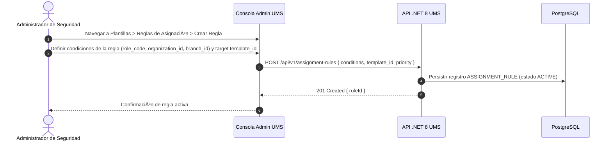

# 🧪 Functional Story 6: Auto-Asignar Plantilla de Autorización al Crear Perfil

Este caso de uso especifica el flujo del **Motor Automático de Asignación de Plantillas Basado en Reglas**, el cual se activa al momento de la creación de un perfil para adjuntar automáticamente la Plantilla de Autorización correspondiente según reglas de coincidencia configurables.

---

## 🏛️ 1. Definición del Caso de Uso

| Atributo | Especificación |
| :--- | :--- |
| **Nombre** | Auto-Asignar Plantilla de Autorización al Crear Perfil |
| **Actor Principal** | Motor de Reglas UMS (Actor del Sistema — disparado automáticamente) |
| **Actor Secundario** | Administrador de Seguridad Global (SuperAdmin — configura las reglas) |
| **Precondiciones** | Al menos una Regla de Asignación está configurada y activa. El perfil desencadenado tiene atributos de metadatos que coinciden con una regla. |
| **Postcondiciones** | El Perfil es creado con `auto_assigned = true`. La plantilla coincidente es vinculada. Las claves de caché de Redis son desalojadas si existen usuarios. Se escribe el registro de auditoría marcado como `auto: true`. |

---

## 🔄 2. Flujo de Configuración de Reglas (Admin — Configuración Única)

---

## 🔄 3. Flujo Disparador de Asignación Automática (Sistema — Al Crear Perfil)

```mermaid
sequenceDiagram
    autonumber
    participant Trigger as Evento de Creación de Perfil
    participant Engine as Motor de Reglas (Servicio de Dominio)
    participant DB as PostgreSQL
    participant Cache as Caché Redis
    participant Audit as Registro de Auditoría

    Trigger->>Engine: Evento ProfileCreatedEvent { profileId, role_code, organization_id, branch_id }
    Engine->>DB: Consultar todas las reglas ASSIGNMENT_RULES activas ordenadas por prioridad
    Engine->>Engine: Evaluar condición de cada regla contra atributos del perfil
    alt Regla Coincidente Encontrada
        Engine->>DB: Vincular template_id al perfil (auto_assigned = true)
        Engine->>Cache: Desalojar claves del grafo en caché (si hay usuarios asignados)
        Engine->>Audit: Registrar Evento TemplateAutoAssignedEvent { profileId, templateId, ruleId, auto: true }
    else No hay Coincidencia de Regla
        Engine->>Audit: Registrar Evento ProfileCreatedNoRuleMatchEvent { profileId }
        Note over Engine: Perfil creado sin plantilla - requiere asignación manual
    end
```

### A. Lógica de Coincidencia de Reglas
Las reglas son evaluadas en **orden de prioridad** (número menor = mayor prioridad). La **primera regla coincidente** gana (evaluación de cortocircuito).

Una regla es coincidente cuando **todas** sus condiciones son satisfechas:

| Campo Condición | Tipo de Coincidencia | Ejemplo de Valor |
| :--- | :--- | :--- |
| `role_code` | Coincidencia exacta | `TransportationAnalyst` |
| `organization_id` | Coincidencia exacta o comodín `*` | `tenant_logistics_corp` |
| `branch_id` | Coincidencia exacta o comodín `*` | `branch_callao_terminal` |
| `system_id` | Coincidencia exacta o comodín `*` | `scm_route_planner` |

**Ejemplo de Regla:**
> *Si `role_code = "TransportationAnalyst"` Y `organization_id = "tenant_logistics_corp"` ENTONCES asignar `Template_SCM_Analyst_Baseline_v1`*

---

## 🛡️ 4. Flujos Alternativos y Manejo de Excepciones

### Flujo Alternativo A: Múltiples Reglas Coinciden
- Si más de una regla coincide con los atributos del perfil, solamente se aplica la **regla de mayor prioridad** (el número de prioridad más bajo). Las demás coincidencias se registran en el rastro de auditoría como candidatas.

### Flujo Alternativo B: Plantilla Objetivo Desactivada
- Si la plantilla correspondiente ha sido desactivada o eliminada desde que se creó la regla, el motor registra una advertencia `RULE_TEMPLATE_UNAVAILABLE` en el rastro de auditoría y pasa a evaluar la siguiente regla coincidente. Si no existe alternativa, el perfil se crea sin asignación de plantilla.

### Flujo Alternativo C: Fallo del Motor de Reglas
- Si el Motor de Reglas lanza una excepción no controlada, **NO se revierte la creación del Perfil** (el perfil se guarda). El fallo del motor se registra como un evento de nivel `CRITICAL` y el perfil se marca para una revisión de asignación manual de plantilla.
