# 🧪 Functional Story 7: Diagnosticar Permisos vía Visualizador de Grafos

Este caso de uso especifica el flujo para que los ingenieros de SRE y los administradores de seguridad diagnostiquen y visualicen el grafo de autorización compilado para un usuario específico dentro de una organización, sede y contexto de sistema objetivo.

---

## 🏛️ 1. Definición del Caso de Uso

| Atributo | Especificación |
| :--- | :--- |
| **Nombre** | Diagnosticar Permisos vía Visualizador de Grafos |
| **Actor Principal** | SRE / Ingeniero de Soporte |
| **Precondiciones** | El actor está autenticado con rol SRE o SuperAdmin en la Consola Admin UMS. El usuario destino existe y tiene al menos un perfil asignado. |
| **Postcondiciones** | El grafo de autorización compilado es renderizado visualmente. El actor puede identificar rutas permitidas (verde), denegadas (rojo) y la razón de cada decisión. |

---

## 🔄 2. Flujo de Transacción

```mermaid
sequenceDiagram
    autonumber
    actor SRE as SRE / Ingeniero Soporte
    participant Console as Consola Admin UMS
    participant API as API .NET 8 UMS
    participant Engine as Motor Auth (PDP)
    participant Cache as Caché Redis
    participant DB as PostgreSQL

    SRE->>Console: Navegar al módulo Visualizador de Grafos
    SRE->>Console: Buscar usuario por email o user_id
    Console->>API: GET /api/v1/users?email=analyst@logisticscorp.com
    API-->>Console: Retornar registro de usuario coincidente
    SRE->>Console: Seleccionar Organización, Sede y Sistema Objetivo
    Console->>API: POST /v1/authorization/graph/diagnostic { user_id, tenant_id, branch_id, system_id }
    Note over API: Omite caché para diagnóstico - siempre re-compila desde DB
    API->>Engine: Disparar compilación fresca del grafo
    Engine->>DB: Consultar todos los perfiles y plantillas para el usuario
    Engine->>Engine: Aplicar reglas de Precedencia de Denegación Explícita
    Engine-->>API: Retornar grafo anotado con razones de decisión por nodo
    API-->>Console: Retornar payload diagnóstico { graph, decisions, source_rules }
    Console->>SRE: Renderizar Árbol Visual interactivo
    Note over Console: Verde = PERMITIDO, Rojo = DENEGADO, Gris = No Asignado
    SRE->>Console: Clic en nodo para ver razón de decisión
    Console->>SRE: Mostrar fuente de regla (template_id, profile_id, efecto, razón)
```

### A. Flujo Principal
1. El SRE navega al módulo **Visualizador de Grafos** en la Consola de Administración.
2. Escribe el correo del usuario o `user_id` en el buscador. El sistema devuelve los registros de usuarios coincidentes.
3. Selecciona la **Organización**, **Sede** y **Sistema** a través de listas desplegables en cascada.
4. Hace clic en **Resolver Grafo**. La API llama al **endpoint de diagnóstico** del Motor de Autorización, el cual **siempre ignora la caché de Redis** y recompila directamente desde PostgreSQL para mostrar el estado actual real (ground-truth).
5. El motor devuelve un grafo anotado que incluye, para cada nodo de Menú/Submenú/Opción/Acción:
    - El `efecto` (`ALLOW`, `DENY` o `NOT_ASSIGNED`).
    - La `fuente de regla` (`template_id` o `profile_id` que produjo el efecto).
    - La `razón` (ej., `Concedido por Template_SCM_Analyst_Baseline_v1`, `Bloqueado por DENY explícito en perfil PortSupervisor_Callao`).
6. La Consola renderiza el árbol interactivamente: **nodos verdes** para PERMITIR (ALLOW), **nodos rojos** para DENEGAR (DENY), **nodos grises** para NO ASIGNADO.
7. El SRE puede hacer clic en cualquier nodo para expandir su panel de justificación de decisión.

---

## 🛡️ 3. Flujos Alternativos y Manejo de Excepciones

### Flujo Alternativo A: Usuario sin Asignaciones de Perfil
- Si el usuario no tiene perfiles activos para el contexto seleccionado, el árbol se renderiza completamente gris con el mensaje: *"No se encontraron asignaciones de perfil activas para este usuario en el contexto seleccionado. Asigne un perfil o plantilla para conceder acceso."*

### Flujo Alternativo B: Sede no Seleccionada (Alcance de Toda la Organización)
- Si el campo sede se deja en blanco, el diagnóstico resuelve permisos a nivel de toda la organización, excluyendo sobreescrituras (overrides) de perfiles con alcance específico de sede.

### Flujo Alternativo C: Presencia de Política de Geocercado (Geofencing)
- Si el grafo compilado contiene metadatos de geocercado ABAC en cualquier nodo, el visualizador muestra la restricción de geocercado en línea (ej., `callao_port_radius_10km`) como una anotación informativa sin evaluar la ubicación en tiempo de ejecución.
