# 🧪 Functional Story 8: Autenticar vía Página de Inicio Personalizable

Este caso de uso detalla el flujo para centralizar la autenticación de usuarios mediante una página de inicio de sesión alojada (hosted) y segura en el UMS, que adapta dinámicamente su diseño (branding) y características para cada inquilino y sistema.

---

## 🏛️ 1. Definición del Caso de Uso

| Atributo | Especificación |
| :--- | :--- |
| **Nombre** | Autenticar vía Página de Inicio Personalizable |
| **Actor Principal** | Usuario Final, Sistema Cliente |
| **Precondiciones** | El sistema cliente está registrado en UMS y ha configurado URLs de redirección de retorno (callbacks). |
| **Postcondiciones** | El usuario es autenticado por el IdP seleccionado (o fallback nativo), y UMS lo redirige de vuelta a la aplicación cliente junto con un JWT firmado. |

---

## 🔄 2. Flujo de Transacción

```mermaid
sequenceDiagram
    autonumber
    participant User as Usuario Final
    participant App as App Cliente
    participant HostedLogin as Portal UMS Login
    participant ConfigAPI as Servicio de Configuración
    participant IdP as Proveedor IdP (SSO/External)
    participant DB as DB Interna PostgreSQL (Bcrypt)

    User->>App: Clic botón "Iniciar Sesión"
    App->>HostedLogin: Redirige /oauth/v2/authorize?client_id={sys_id}&tenant_id={t_id}&redirect_uri={cb}
    HostedLogin->>ConfigAPI: Solicitar branding activo y config de sistema
    ConfigAPI-->>HostedLogin: Retornar metadata de branding
    HostedLogin->>HostedLogin: Renderizar CSS y Logo (Compilación HTML dinámica)
    HostedLogin-->>User: Presentar Login Personalizado (Mostrando opciones)
    
    alt Autenticación Externa (IDP / SSO)
        User->>HostedLogin: Selecciona opción SSO (ej., Entra ID)
        HostedLogin->>IdP: Delegar verificación
        IdP-->>HostedLogin: Éxito en verificación y claims del usuario
    else Autenticación Interna (Credenciales Nativas)
        User->>HostedLogin: Ingresa Usuario y Contraseña Local
        HostedLogin->>DB: Validar hash Bcrypt
        DB-->>HostedLogin: Confirmación de credenciales válidas
    end
    
    HostedLogin->>HostedLogin: Generar JWT firmado con contextos del tenant
    HostedLogin-->>User: Redirección 302 hacia redirect_uri?code={auth_code}
    User->>App: Entrega en endpoint callback con el código
```



### A. Flujo Principal
1. Un Usuario Final visita una aplicación registrada (ej. Portal SCM) y hace clic en "Iniciar Sesión".
2. La aplicación redirige el navegador del usuario hacia el Portal Centralizado de Login (Hosted) de UMS, enviando su `client_id` (ID Sistema), `tenant_id` y un `redirect_uri` verificado en los parámetros de consulta.
3. El Portal de Login UMS consulta el Servicio de Configuración para obtener el diseño de marca activo (logo, colores, clases CSS personalizadas) asociado con dicho Inquilino y Sistema.
4. El Servicio de Configuración resuelve la estructura utilizando el motor de resolución jerárquico (aplicando sobreescrituras a nivel Tenant y Sistema).
5. La página de login inyecta las propiedades de hojas de estilo, URL de logotipo y fuentes en el DOM en tiempo de ejecución.
6. El usuario visualiza una interfaz premium, alineada a la marca de la organización, que muestra únicamente las opciones de IdP permitidas para ese Tenant (ej. "Ingresar con Microsoft Entra" o "Passkey sin Contraseña").
7. El usuario completa el flujo de autenticación. El Portal de Login UMS autentica al usuario contra el IdP configurado.
8. Tras la validación exitosa, UMS emite un JWT estándar y criptográficamente firmado que incluye el grafo de permisos compilado y los alcances del tenant.
9. El Portal de Login redirige el navegador del usuario hacia la URL de retorno (callback `redirect_uri`) con un código de autorización.

---

## ⚙️ 3. Opciones Dinámicas de Diseño (Branding)

La página alojada soporta las siguientes variables configurables almacenadas como JSON en la base de datos `SYSTEM_CONFIGURATION`:

```json
{
  "branding": {
    "theme": "dark",
    "primary_color": "#0F52BA",
    "logo_url": "https://cdn.logisticscorp.com/assets/logo.png",
    "custom_css_url": "https://cdn.logisticscorp.com/styles/login-override.css",
    "font_family": "Outfit, sans-serif"
  },
  "login_behaviors": {
    "show_passkey_option": true,
    "allow_remember_me": false
  }
}
```

---

## 🛡️ 4. Manejo de Excepciones

### Flujo Alternativo A: URI de Redirección Inválida
- Si la `redirect_uri` suministrada en la consulta no coincide con la lista blanca permitida registrada para ese sistema en el UMS, el flujo de login se aborta de inmediato. El portal muestra una página segura `400 Bad Request` y levanta una alerta de seguridad.

### Flujo Alternativo B: Timeout al Obtener Branding
- Si el Servicio de Configuración no responde o agota el tiempo de espera, el Portal Login de UMS aplica el layout Global predeterminado (un tema neutro y oscuro) garantizando que los servicios de autenticación permanezcan completamente disponibles.
