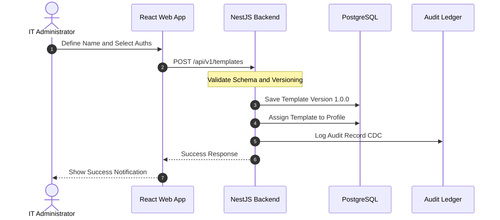

> ?? **Nota de Arquitectura:** Este documento se encuentra actualmente en su versi�n original (Ingl�s) y est� programado para traducci�n oficial en la hoja de ruta.

# 🧪 Use Case 3: Create & Instantiate Authorization Template

This document specifies the transaction flow, actors, and versioning rules for creating a reusable policy template and linking it to profile workspaces under the **spec-driven AI strategy BMAD-METHOD**.

---

## 🏛️ 1. Use Case Definition

| Attribute | Specification |
| :--- | :--- |
| **Name** | Create & Instantiate Authorization Template |
| **Primary Actor** | Global IT Administrator |
| **Preconditions** | Systems, Menus, Options, and Actions are registered in the system. |
| **Postconditions** | Authorization Template is created, and all linked Profiles inherit the policies in real time. |

---

## 🔄 2. Transaction Flow

### A. Main Flow
1.  The Global IT Administrator navigates to the Template Manager section in the admin portal and clicks the "Create New Template" button.
2.  The administrator defines the template metadata (name: `PortOperatorBaseline`, initial version: `v1.0.0`).
3.  The administrator selects the specific `Systems`, `Menus`, and `Actions` that this template will allow (e.g., allow `create` and `read` on `Containers`).
4.  The administrator submits the creation form. The web app dispatches a `POST` request to `/api/v1/templates`.
5.  The backend validates the authorization schema and inserts the Template and corresponding Template Authorizations inside PostgreSQL within a single secure database transaction.
6.  The administrator selects an existing `Profile` (or creates a new one) and links it to the newly created `Template`.
7.  The system automatically updates all user sessions belonging to that profile, invalidates matching Redis cache keys, and writes an entry into the immutable audit trail ledger.

---

## 🛡️ 3. Alternative Flows & Exception Handling

### Alternative Flow A: Schema Validation Failure
*   If the administrator attempts to assign an invalid action (e.g., an action targeting a non-existent menu or option), the backend intercepts the request and rejects the transaction with a `400 Bad Request` explaining the validation error.

### Alternative Flow B: Major Version Upgrade Conflict
*   If updating a template introduces breaking changes that conflict with local custom overrides on certain Profiles, the system prompts the administrator with a compatibility warning, requiring explicit approval before applying the changes globally.

