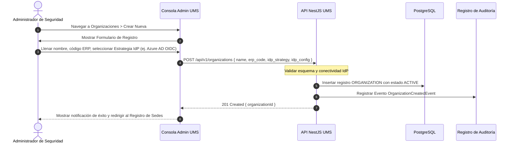

# 🏢 Caso de Uso 4: Registrar Organización y Configurar Estrategia de IdP

Este caso de uso especifica el flujo para integrar a un nuevo inquilino corporativo (Organización) en el UMS y configurar su estrategia de autenticación de identidad.

---

## 🏛️ 1. Definición del Caso de Uso

| Atributo | Especificación |
| :--- | :--- |
| **Nombre** | Registrar Organización y Configurar Estrategia de IdP |
| **Actor Principal** | Administrador de Seguridad Global (SuperAdmin) |
| **Precondiciones** | El actor está autenticado como SuperAdmin en la Consola de Administración UMS. |
| **Postcondiciones** | La Organización está registrada y activa. La estrategia IdP está persistida. Las sedes pueden ser registradas. |

---

## 🔄 2. Flujo de Transacción

### A. Flujo Principal
1. El SuperAdmin navega al módulo de **Organizaciones** en la Consola de Administración.
2. Llena el formulario de registro: nombre legal de la empresa, código de referencia ERP y selecciona la estrategia IdP de la lista de complementos (`INTERNAL_BCRYPT`, `ZITADEL`, `AZURE_AD`, `OKTA`, `SAML2`, `GENERIC_OIDC`).
3. Si se selecciona un IdP externo, el formulario se expande dinámicamente para recopilar los campos de configuración OIDC/SAML requeridos (ID de cliente, URL de autoridad, certificados).
4. Al enviar, la API valida la configuración (opcionalmente realiza una prueba de estado de conectividad del IdP).
5. La organización se persiste, se escribe un registro de auditoría inmutable y el administrador es redirigido para registrar las sedes.

---

## 🛡️ 3. Flujos Alternativos y Manejo de Excepciones

### Flujo Alternativo A: Fallo de Conectividad IdP
- Si la URL de descubrimiento OIDC/SAML suministrada es inalcanzable, la API devuelve un `422 Unprocessable Entity` con el código de error `ERR_IDP_UNREACHABLE`. El registro de la organización **no** es persistido.

### Flujo Alternativo B: Código ERP Duplicado
- Si la `company_reference` (código ERP) ya existe, la API devuelve un `409 Conflict` con el código de error `ERR_DUPLICATE_ORG_CODE`.
