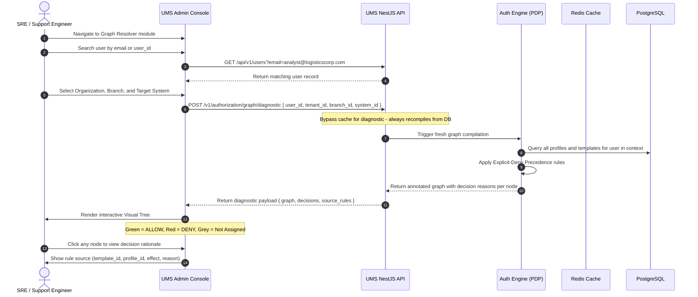

> ?? **Nota de Arquitectura:** Este documento se encuentra actualmente en su versiÛn original (InglÈs) y est· programado para traducciÛn oficial en la hoja de ruta.

# üß™ Use Case 8: Diagnose User Permissions via Visual Graph Resolver

This use case specifies the flow for SRE engineers and security administrators to diagnose and visualize the compiled authorization graph for a specific user within a target organization, branch, and system context.

---

## 🏛️ 1. Use Case Definition

| Attribute | Specification |
| :--- | :--- |
| **Name** | Diagnose User Permissions via Visual Graph Resolver |
| **Primary Actor** | SRE / Support Engineer |
| **Preconditions** | Actor is authenticated with SRE or SuperAdmin role in the UMS Admin Console. Target user exists and has at least one profile assignment. |
| **Postconditions** | The compiled authorization graph is rendered visually. The actor can identify allowed paths (green), denied paths (red), and the reason for each decision. |

---

## 🔄 2. Transaction Flow

### A. Main Flow
1. SRE navigates to the **Graph Resolver** module in the Admin Console.
2. Types the user's email or `user_id` in the search input. The system returns matching user records.
3. Selects the **Organization**, **Branch**, and **System** context from cascading dropdowns.
4. Clicks **Resolve Graph**. The API calls the Authorization Engine's **diagnostic endpoint**, which **always bypasses the Redis cache** and recompiles directly from PostgreSQL to show the current ground-truth state.
5. The engine returns an annotated graph that includes, for each Menu/Submenu/Option/Action node:
    - The `effect` (`ALLOW`, `DENY`, or `NOT_ASSIGNED`)
    - The `source_rule` (template_id or profile_id that produced the effect)
    - The `reason` (e.g., `Granted by Template_SCM_Analyst_Baseline_v1`, `Blocked by Explicit DENY in profile PortSupervisor_Callao`)
6. The Console renders the tree interactively: **green nodes** for ALLOW, **red nodes** for DENY, **grey nodes** for NOT_ASSIGNED.
7. SRE can click any node to expand its decision rationale panel.

---

## 🛡️ 3. Alternative Flows & Exception Handling

### Alternative Flow A: User Has No Profile Assignments
- If the user has no active profiles for the selected context, the tree renders as completely grey with the message: *"No active profile assignments found for this user in the selected context. Assign a profile or template to grant access."*

### Alternative Flow B: No Branch Selected (Org-Wide Scope)
- If branch is left empty, the diagnostic resolves org-wide permissions only, excluding branch-scoped profile overrides.

### Alternative Flow C: Geofencing Policy Present
- If the compiled graph contains ABAC geofencing metadata on any node, the resolver displays the geofencing constraint inline (e.g., `callao_port_radius_10km`) as an informational annotation without evaluating runtime location.

