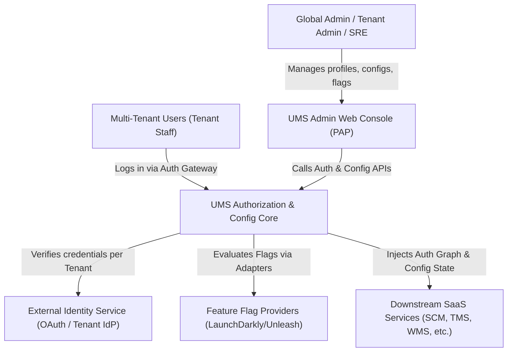
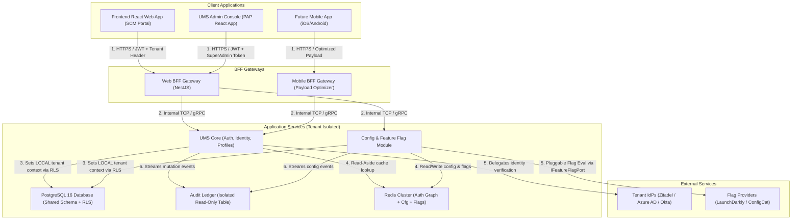
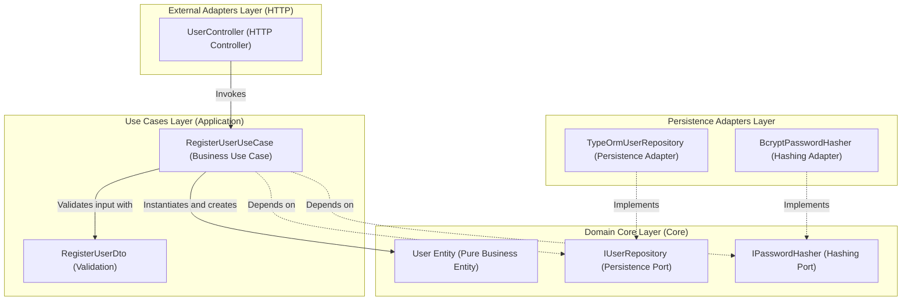

> ?? **Nota de Arquitectura:** Este documento se encuentra actualmente en su versi�n original (Ingl�s) y est� programado para traducci�n oficial en la hoja de ruta.

# 🏛️ Software Architecture Design Document (UMS)

This document details the formal system design specification for the **`arc-nodejs-workspace`** monorepo. It adopts the **C4 Model** software modeling standard (Level 1: System Context, Level 2: Containers, Level 3: Components) and presents the unified and audited technical inventory of the project.

> [!IMPORTANT]
> **Engineering Standards Mandate:** All architectural decisions described here are strictly governed by the **[Global Engineering Standards & BMAD Manifesto](../04-artifacts/engineering-standards.md)**. Principles like SOLID, Clean Architecture, optional DDD, and the avoidance of anti-patterns are mandatory and automatically enforced via CI/CD pipelines.

---

## 🎯 1. Architectural Deliverables & Requirements Baseline

The following table defines the mandatory deliverables, strategic scope, and contractual design requirements governing the software architecture of this monorepo:

| Priority | Deliverable | Description (Strategic Level – Executive Rationale) |
| :--- | :--- | :--- |
| **1** | Bounded Context Map | Representation of the bounded contexts of the UMS IAM domain, their responsibilities, how they relate, and how they will evolve. Establishes a clear functional scope for teams and budgeting. |
| **2** | Platform Core Definition | Strategy that identifies cross-cutting capabilities (Identity, Master Data, Event Bus, API Gateway), their common purpose, and reuse principles. Justifies investments in shared components. |
| **3** | C4 Diagram (Context, Container, Component) | Architectural vision at levels 1 and 2: external systems, large containers, and communication between them. Sizes technical complexity and allows estimating effort without detailing classes or internal components. |
| **4** | Database Strategy | Substantiates the choice of persistence pattern (Database-per-Module), guidelines for distributed transactions, and general backup and recovery policies. Details the impact on costs and operations. |
| **5** | Event Domain Model (Event Storming) | Map of relevant business events, their producers, and consumers, along with delivery and ordering principles. Guides integration and the effort associated with orchestration/choreography. |
| **6** | End-to-End Observability Strategy | Approach to distributed telemetry: traceability of complete business processes, key metrics, and logging models at the architectural level. Used to estimate monitoring tools and costs. |
| **7** | Identity & Authorization Design | Strategy for the identity and authorization model: Identity Provider (IdP), authentication flow between contexts, and session guidelines. Helps size security across all domains. |
| **8** | Documented Non-Functional Requirements (NFRs) | Definition of measurable non-functional requirements that condition the architecture: latency, throughput, availability, and graceful degradation mechanisms. Represents contractual targets that the design must meet. |
| **9** | Master Data Management Strategy | Work plan for master data: key entities, migration approach from SAP, quality guidelines, and phases. Justifies the integration and data cleansing effort in the budget. |
| **10** | API Versioning & Evolution Strategy | Guidelines for contract evolution (APIs and events): how changes are introduced without breaking dependencies. Forecasts technical governance and the cost of maintaining compatibility. |
| **11** | Multi-Domain Synchronization Strategy | Approach to eventual consistency between contexts: definition of sources of truth, duplication guidelines, and conflict resolution. Reveals integration complexity and its impact on timelines. |
| **12** | Initial Architecture Decision Records (ADRs) | Log of the most influential architectural decisions, their justification, and alternatives. Backs up why a specific path was chosen, clarifying risks and assumed costs. |
| **13** | Integration Contract Testing Plan | Strategy to ensure interactions between contexts comply with their contracts, integrated into the CI/CD pipeline. Justifies quality assurance in integrations without detailing specific tools. |
| **14** | Deployment Infrastructure | Layout of the topology (cloud/on-premise/hybrid), key managed services, and operational cost estimations. Provides a financial and technical baseline for sizing. |
| **15** | Work Breakdown Structure & Plan | Roadmap with phases, sprints, profiles, milestones, and acceptance criteria. Translates strategy into a schedule and justifies workload and costs for each stage. |

---

## 🗺️ 2. C4 Model

The architectural design of UMS is modeled at three progressive levels of abstraction to align business vision with physical code implementation.

### Level 1: System Context Diagram
Defines the boundary of the User Management System (UMS) interacting with corporate users and external identity services.

---

### Level 2: Container Diagram
Maps the physical subsystems (React Frontend, NestJS API, PostgreSQL Database) that make up the monorepo and how they communicate using secure protocols.

---

### Level 3: API Component Diagram
An interactive zoom into the **NestJS API** structure, demonstrating the flow of control towards the core (*Inversion of Control*) of the Hexagonal Architecture.

---

## 📊 3. Dependency Technical Inventory (Sovereign Tech Inventory)

This inventory details all tools, libraries, plugins, and components per workspace with their respective installed version, technical lifecycle recommendation (*Staff Recommendation*), and official reference URL.

### 🦁 A. Backend (NestJS API Layer)

| Dependency / Library | Installed Version | Technical Recommendation | Reference URL |
| :--- | :--- | :--- | :--- |
| `@nestjs/core` | `^10.0.0` | **Keep (Stable)** - Robust core for dependency injection. | [NestJS Docs](https://docs.nestjs.com/) |
| `@nestjs/throttler` | `^6.5.0` | **Keep (Stable)** - Prevention of brute force and local DDoS attacks. | [NestJS Rate Limiting](https://docs.nestjs.com/security/rate-limiting) |
| `@nestjs/typeorm` | `^11.0.1` | **Keep (Stable)** - Native persistence integration with transaction support. | [NestJS TypeORM](https://docs.nestjs.com/techniques/database) |
| `typeorm` | `^0.3.28` | **Keep (Stable)** - Mature ORM with excellent migration support and Type Safety. | [TypeORM Official](https://typeorm.io/) |
| `bcrypt` | `^6.0.0` | **Keep (Stable)** - Robust cryptographic algorithm for password storage. | [Bcrypt GitHub](https://github.com/kelektiv/node.bcrypt.js) |
| `helmet` | `^8.1.0` | **Keep (Critical)** - Automatic injection of secure HTTP headers (CORS, XSS). | [Helmet Docs](https://helmetjs.github.com/) |
| `pg` | `^8.20.0` | **Keep (Stable)** - High-performance native connection driver for PostgreSQL. | [Node Postgres](https://node-postgres.com/) |
| `class-validator` | `^0.15.1` | **Keep (Stable)** - Declarative validation of DTOs at runtime. | [Class Validator](https://github.com/typestack/class-validator) |

---

### ⚛️ B. Frontend (React Web Client)

| Dependency / Library | Installed Version | Technical Recommendation | Reference URL |
| :--- | :--- | :--- | :--- |
| `react` | `^18.3.1` | **Keep (Stable)** - Ultra-stable version compatible with mature ecosystems. | [React Documentation](https://react.dev/) |
| `vite` | `^5.4.10` | **Keep (Stable)** - Ultra-fast bundler compatible with Node 18. | [Vite JS](https://vitejs.dev/) |
| `@tanstack/react-query`| `^5.100.9` | **Keep (Critical)** - Asynchronous server state synchronization and smart caching. | [TanStack Query Docs](https://tanstack.com/query/latest) |
| `zustand` | `^5.0.13` | **Keep (Stable)** - Lightweight global state manager alternative to Redux. | [Zustand GitHub](https://github.com/pmndrs/zustand) |
| `tailwindcss` | `^3.4.19` | **Keep (Stable)** - High-performance utility-first CSS engine. | [Tailwind CSS](https://tailwindcss.com/) |
| `axios` | `^1.16.0` | **Keep (Stable)** - Robust HTTP client with global interceptor support. | [Axios Docs](https://axios-http.com/) |
| `lucide-react` | `^1.14.0` | **Keep (Stable)** - Modern collection of reactive SVG icons. | [Lucide Icons](https://lucide.dev/) |

---

### 🛠️ C. Quality and Global Governance (Root Monorepo)

| Dependency / Library | Installed Version | Technical Recommendation | Reference URL |
| :--- | :--- | :--- | :--- |
| `nx` | `^20.3.0` | **Keep (Critical)** - High-performance task runner with caching support. | [Nx Dev Docs](https://nx.dev/) |
| `eslint-plugin-boundaries`| `^5.0.0` | **Keep (Stable)** - Strict governance for Hexagonal boundaries. | [eslint-plugin-boundaries](https://github.com/javierguzman/eslint-plugin-boundaries) |
| `eslint-plugin-sonarjs` | `^3.0.0` | **Keep (Stable)** - Zero-cost Sonar static analysis for local projects. | [SonarJS ESLint](https://github.com/SonarSource/eslint-plugin-sonarjs) |
| `husky` | `^9.0.0` | **Keep (Stable)** - Interception and automation of Git Hooks. | [Husky Docs](https://typicode.github.io/husky/) |
| `lint-staged` | `^15.0.0` | **Keep (Stable)** - Optimized execution of linters only on Git Staged files. | [lint-staged GitHub](https://github.com/lint-staged/lint-staged) |

---

## 🧠 4. Architectural Decision Matrix

This matrix maps foundational technical decisions to their targeted Quality Attributes, summarizing the architectural strategy and enforcement mechanisms to ensure a verifiable and sustainable system under the **spec-driven AI strategy BMAD-METHOD**:

| Decision / Focus | ADR Reference | Primary Quality Attributes | Decision Summary & Technical Strategy | Enforcement & Verification Mechanism |
| :--- | :--- | :--- | :--- | :--- |
| **Monorepo Orchestration** | [ADR 0001](../03-adrs/0001-monorepo-orchestration-nx.md) | Modularity, Build Performance | Uses Nx & npm workspaces to manage decoupled modules with localized configurations. | Nx cache verification and localized dependency schema checks. |
| **Hexagonal Boundaries** | [ADR 0002](../03-adrs/0002-clean-architecture-nestjs.md) | Decoupling, Testability, Agnosticism | Implements three strict layers: Core (Entities), Application (Use Cases), Infrastructure (Adapters). | `eslint-plugin-boundaries` blocks unauthorized outer-to-inner imports. |
| **Observability Telemetry** | [ADR 0007](../03-adrs/0007-observability-telemetry-loki-opentelemetry.md) | Observability, Performance, Monitoring | Grafana LGTM Stack (Loki + Grafana + Tempo) with OpenTelemetry (OTel). | OpenTelemetry integration tests and Grafana dashboards monitoring. |
| **Dependency Governance** | [ADR 0009](../03-adrs/0009-strict-dependency-pinning-vulnerability-management.md) | Security, Stability, Determinism | Enforces zero-tolerance for dynamic versions (`^`/`~` removed) to guarantee reproducible builds. | `npm audit --audit-level=high` runs in CI to block vulnerable PRs. |
| **Multi-Tenancy SaaS** | [ADR 0010](../03-adrs/0010-multi-tenancy-architecture-strategy.md) | Security, Data Isolation, Cost Efficiency | Shared Database schema with PostgreSQL Row-Level Security (RLS) to enforce tenant isolation. | `AsyncLocalStorage` propagates Tenant Context; TypeORM Subscribers validate RLS. |
| **Fault Tolerance & Resiliency** | [ADR 0011](../03-adrs/0011-fault-tolerance-resiliency-patterns.md) | Resilience, Reliability, Consistency | Circuit Breaker (`opossum`) + Exponential Backoff retries strictly wrapped inside Infrastructure Adapters. | Jest mocks simulating HTTP failures and verifying circuit state transitions. |
| **Granular Authorization** | [ADR 0012](../03-adrs/0012-advanced-authorization-rbac-abac.md) | Security, Traceability, SoC | Tenant-aware RBAC/ABAC using JWT claim decoders and NestJS execution context Guards. | Integration tests simulating cross-tenant access attempts. |
| **Distributed Caching** | [ADR 0014](../03-adrs/0014-distributed-caching-strategy-redis.md) | Performance, Database Offloading | Read-Aside caching with Redis store, completely hidden behind a pure Core `ICachePort` abstraction. | Redis integration tests and strict TTL verification. |
| **Event-Driven Decoupling** | [ADR 0015](../03-adrs/0015-event-driven-architecture-intra-domain.md) | Decoupling, Scalability, Extensibilidad | Monolith modules communicate asynchronously using an internal event bus hidden behind `IEventBusPort`. | Unit tests verifying asynchronous execution paths and payload formats. |
| **Immutable Auditing** | [ADR 0016](../03-adrs/0016-immutable-business-audit-trail.md) | Traceability, Compliance, Security | Automatically tracks business-critical mutations (Old Value -> New Value) using database subscribers. | TypeORM Lifecycle Hook interceptors with strictly isolated tables. |
| **Tactical Domain Integrity** | [ADR 0019](../03-adrs/0019-tactical-design-patterns-future-proofing.md) | Decoupling, Clarity, Dapr Readiness | Uses Result Pattern, Null Objects, and Decorators to protect the Core from throwing HTTP/external framework errors. | Mandatory return types and custom ESLint boundaries rules. |
| **Identity Provider Abstraction** | [ADR 0020](../03-adrs/0020-identity-provider-abstraction-strategy.md) | Decoupling, Vendor Neutrality, Extensibilidad | Abstracts external directories (Zitadel, Okta, SAML) via the Strategy Pattern wrapped under a Hexagonal Port. | Jest unit tests verifying agnostic credential routing. |
| **High-Performance Compilation** | [ADR 0021](../03-adrs/0021-high-performance-auth-and-graph-compilation.md) | Performance, Ultra-Low Latency, Scalability | Resolves dynamic hierarchical permission graphs under 5ms using Redis read-aside caching. | Locust load tests and SRE telemetry tracing. |
| **Contextual Authentication** | [ADR 0022](../03-adrs/0022-contextual-auth-and-pluggable-projections.md) | Multi-Tenancy, Customization, Extensibilidad | Supports localized corporate branch context resolution and projects compiled graphs into multiple output formats. | Integration tests verifying branch-specific (sedes) dynamic menu structures. |
| **Centralized Auth Kernel** | [ADR 0023](../03-adrs/0023-centralized-ums-vs-decentralized-access.md) | Security, SoC, Governance | Establishes the UMS as a centralized authorization core shared across all enterprise applications. | Strict ESLint boundary checks and centralized access ledger audits. |

---

## 📈 5. Technical Debt Management & Architectural Roadmap (Backlog)

To guarantee the healthy evolution of the monorepo towards distributed models and production telemetry, the following items are established in the architecture backlog:

*   **[ADR 0006: Future Microservices Transition with Dapr](../03-adrs/0006-future-microservices-transition-dapr.md)**: Establishes the technical criteria and triggers that will determine when to split the modular monolith into independent microservices governed by Dapr sidecars.
*   **[ADR 0008: Progressive Multi-Module Evolution with API Gateway and BFF](../03-adrs/0008-progressive-multimodule-evolution-gateway-bff.md)**: Establishes the progressive design to transform this 100% Node.js reference solution into a multi-module portal capable of integrating independent systems (TMS, WMS, etc.) exposed as services with isolated databases, consumed via a central API Gateway and optimized through Backend For Frontend (BFF) gateways for Web and Mobile clients.
*   **[ADR 0009: Strict Dependency Pinning and Automated Vulnerability Management](../03-adrs/0009-strict-dependency-pinning-vulnerability-management.md)**: Establishes the strategy of zero-tolerance for dynamic dependency versions, enforcing static versions across the monorepo, with automated dependency bot updates and high/critical CI vulnerability checks.
*   **[ADR 0010: Multi-Tenancy Architecture Strategy for SaaS Evolution](../03-adrs/0010-multi-tenancy-architecture-strategy.md)**: Establishes the hybrid pooled multi-tenancy strategy utilizing a shared PostgreSQL schema coupled with Row-Level Security (RLS) to enforce absolute data isolation at the engine level for cost-effective SaaS scalability.
*   **[ADR 0013: Cloud Infrastructure Topology & DR](../03-adrs/0013-cloud-infrastructure-topology-dr.md)**: Establishes high availability and disaster recovery topologies across multiple availability zones.
*   **[ADR 0024: Configuration & Feature Management Platform](../03-adrs/0024-configuration-feature-management-platform.md)**: Extends UMS to handle dynamic system configuration and multi-IdP setups.
*   **[ADR 0025: Feature Flag Provider Abstraction](../03-adrs/0025-feature-flag-provider-abstraction.md)**: Pluggable framework for external flag providers via `IFeatureFlagPort`.

---

## 🛡️ 6. Financial & Operational Risk Assessment

An exhaustive evaluation of **"Build vs. Buy"** decisions, licensing implications, and operational costs associated with the sovereign tech stack. 

*   **[Vendor Lock-In & Financial Risk Assessment](./vendor-risk-assessment.md)**: Baseline documentation analyzing Identity Providers, Redis licensing, Feature Flag platforms, and Nx Cloud caching to prevent unexpected financial burdens.

---

## 🏛️ 7. Centralized Authorization Engine Architecture (PEP/PDP/PAP/PIP)

To support secure, context-aware, and highly scalable access control across all corporate applications, the system adopts a centralized **User Management System (UMS)** serving as a shared "authorization kernel". This architecture decouples identity validation from dynamic permission resolution by implementing standard **XACML Architectural Reference Model** layers:

1.  **Policy Enforcement Point (PEP)**: Intercepts incoming client requests at the API Gateway or individual SCM/NestJS Guards, enforcing access rules by reading the returned authorization graph.
2.  **Policy Decision Point (PDP)**: The core UMS Engine. It compiles and resolves fine-grained permissions into a cached, hierarchical graph under 5ms using Redis.
3.  **Policy Administration Point (PAP)**: The UMS administrative portal where security teams manage baseline templates, tenant profiles, and explicit permission rules.
4.  **Policy Information Point (PIP)**: Relational PostgreSQL registries supplying active tenant, branch (sedes), and user attributes during graph evaluation.

By utilizing the **Strategy Pattern** for dynamic output projections, the UMS can format the compiled graph into a variety of target structures on-the-fly (including frontend-optimized JSON, cryptographically signed JWT scopes, or Claims-based lists), ensuring high adaptability and complete zero-lock-in longevity. For a complete analysis of the SCM Transportation Analyst reference model and API contracts, consult **[enterprise-iam-ums-specification.md](../04-artifacts/enterprise-iam-ums-specification.md)**.

