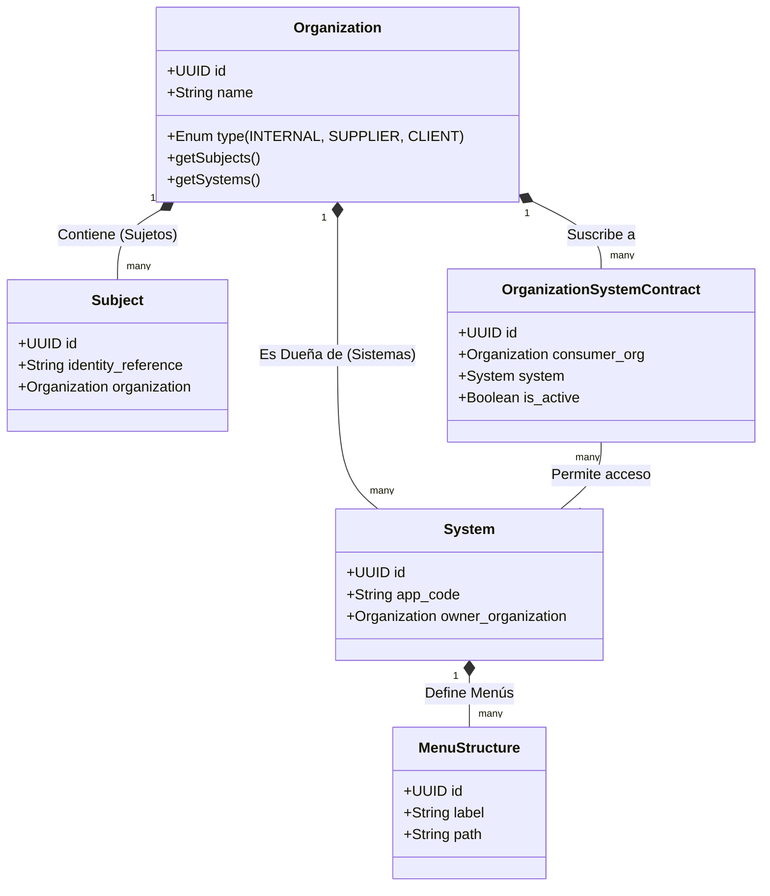

# ADR-0032: La Organización como Límite Estratégico del Dominio (Frontera de Propiedad y Seguridad)

*   **Estado:** Propuesto
*   **Fecha:** 2026-05-13
*   **Autores:** Equipo de Arquitectura Senior & Product Owners

---

## 🏛️ 1. Contexto y Problema

En el desarrollo de arquitecturas empresariales distribuidas y multi-inquilino (Multi-Tenant), existe un riesgo recurrente de tratar a los activos tecnológicos (Sistemas, Menus, Features) y a las entidades de identidad (Usuarios, Personas) como inventarios planos globales.

### ⚠️ Deficiencias del Modelo Tradicional
Anteriormente, el sistema corría el riesgo de permitir acoplamientos ambiguos donde:
1.  Los **Usuarios** (o Empleados) "flotaban" globalmente vinculándose por atributos débiles a las empresas.
2.  Los **Sistemas** y Aplicaciones eran tratados como un catálogo agnóstico universal, careciendo de una clara definición de "Propiedad" (*Ownership*).
3.  Las jerarquías de permisos asumían que una opción de menú o una acción pertenecía únicamente al rol de sistema, sin importar el contexto organizacional que consume u opera el recurso.

Esta falta de contención unificada compromete el principio de **Zero Trust** (Confianza Cero) e introduce riesgos operacionales de "fuga de datos" (*data bleeding*) entre diferentes inquilinos B2B que comparten el ecosistema de la suite de SCM.

---

## 🎯 2. Decisión Arquitectónica

Hemos decidido formalizar una **Refactorización Estructural del Dominio** donde la entidad **`Organization` (Organización)** se eleva como la **Raíz Principal de Gobernanza, Límite de Propiedad (Ownership Boundary) y Frontera de Seguridad (Security Boundary)** del ecosistema.

Las directrices obligatorias de esta contención jerárquica son:

1.  **Contención Dual Obligatoria:** Una Organización es el contenedor lógico absoluto que contiene simultáneamente:
    *   **Sujetos/Personas:** Los referentes humanos y bots que actúan bajo su tutela.
    *   **Sistemas/Recursos:** Los aplicativos, configuraciones, menús y permisos asignados o contratados bajo su control.
2.  **Jerarquía y Flujo de Autorización:** El grafo de compilación de permisos y renderizado dinámico debe leerse jerárquicamente como:
    `Organización ➔ Sujeto ➔ Rol ➔ Sistema ➔ Módulo/Menú ➔ Acción`.
3.  **Aislamiento de Recursos Propios y Delegados:** 
    *   Un Sistema posee un atributo obligatorio `owner_organization_id` (quien provee y administra el software).
    *   Las Organizaciones consumidoras obtienen una relación de delegación contractualmente aprobada para inyectar dicho Sistema en su alcance visual de Menús y Funcionalidades.

---

## 📊 3. Diagrama Conceptual del Dominio Objetivo



---

## ⚖️ 4. Riesgos, Trade-offs y Mitigaciones

### ⚠️ El Riesgo del Objeto Dios (God Entity)
Elevar a la `Organization` como límite central puede inducir a los desarrolladores a inyectarle demasiada lógica de negocio interna de múltiples Bounded Contexts, creando una entidad monolítica centralizada inmanejable.

**Mitigación DDD:** La Organización no será un único objeto de software gigante. En su lugar, actuará como un ID de frontera contextualizado:
*   En el Bounded Context de **Identity**: Almacena metadata corporativa e IdP.
*   En el Bounded Context de **Authorization**: Actúa como la partición RLS de almacenamiento del Grafo.
*   En el Bounded Context de **Configuration**: Es la clave raíz para la resolución de Overrides jerárquicos.

---

## 🚀 5. Estrategia de Transición y Compatibilidad

Para transicionar de forma fluida sin romper el código existente:

1.  **Asociación de Legacy Systems:** Todos los sistemas registrados en bases de datos previas que carecen de dueño serán mapeados por script de migración de datos a la Organización Central Operadora (`LOGISTICS_CORP_ROOT`).
2.  **Validación del Middleware de Gateway:** El API Gateway inyectará el encabezado `X-Org-Context-Id` validando simultáneamente que el `Subject` que realiza el request y el `System` solicitado estén contractualmente autorizados bajo el árbol de esa Organización.
3.  **Contrato del Payload JWT:** El token JWT emitido por el AuthCore incluirá el claim compuesto:
    ```json
    {
      "sub_ref": "S-12345",
      "org_id": "ORG-XYZ-789",
      "allowed_systems": ["SCM", "WMS"]
    }
    ```
    Esto garantiza que a nivel de frontend y microservicios no exista latencia para filtrar los menús locales.
